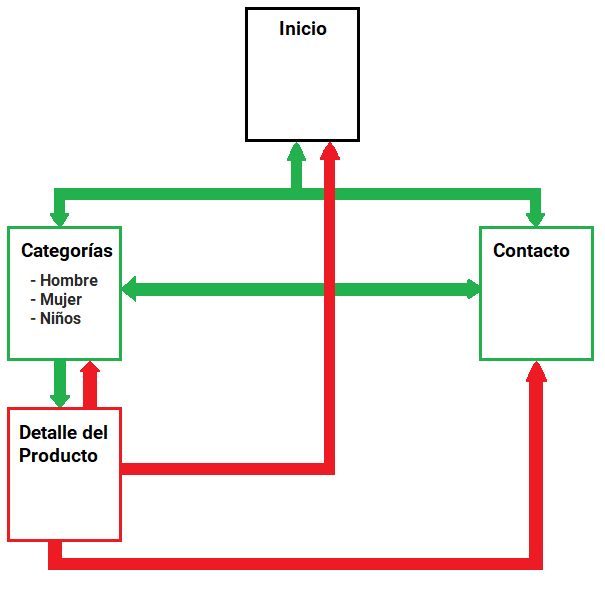
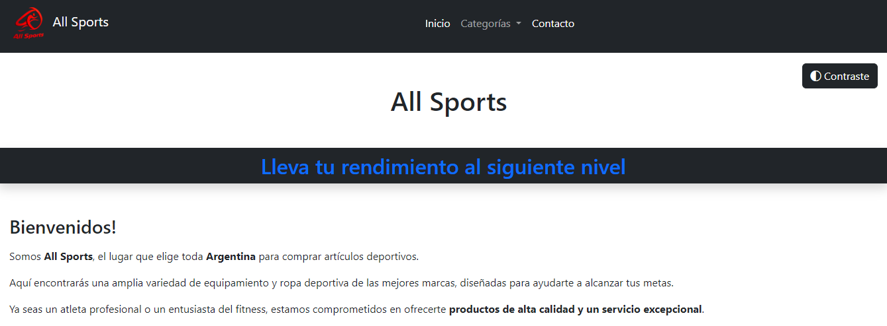
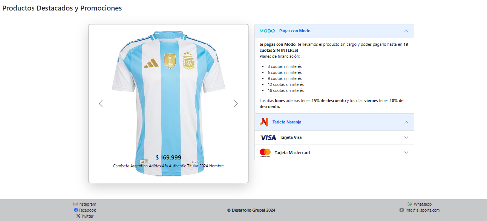
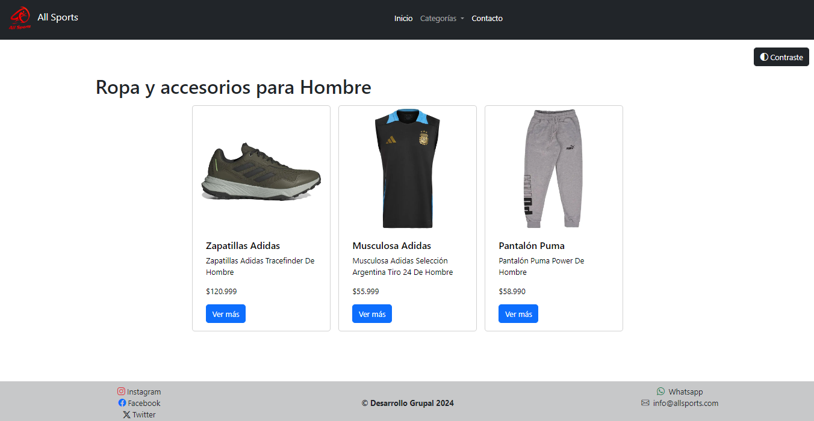
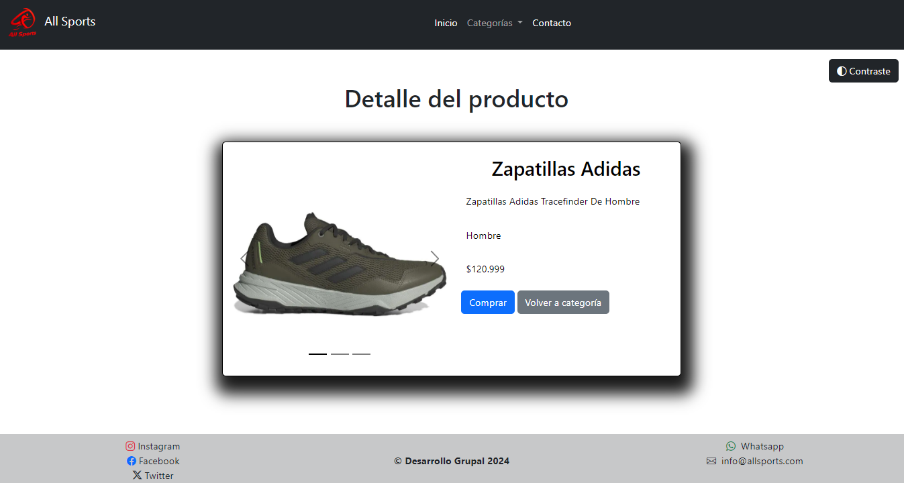
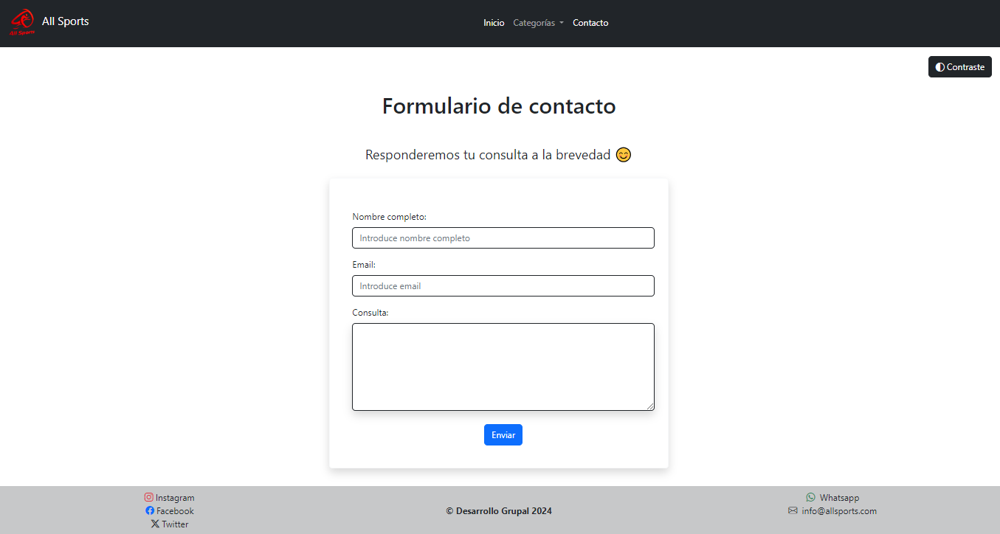
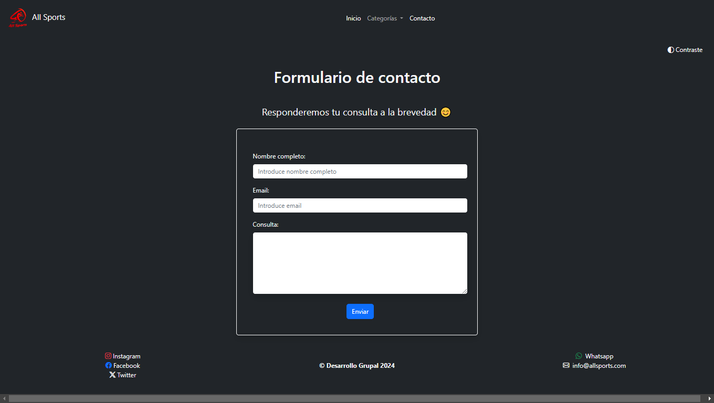

# Proyecto Grupal - All Sports

## Integrantes del equipo

- **[Dardo Santana](https://github.com/dardosantana)**
- **[Lautaro de la Mano](https://github.com/Lautidelamano)**
- **[Fernando Barrionuevo](https://github.com/Rasta07)**
- **[Mario Aguilar](https://github.com/mario-r-aguilar)**

## Objetivo

Este proyecto forma parte de los trabajos prácticos que se van solicitando
a lo largo del bootcamp dictado por Cilsa. Tanto el nombre de la empresa
como el contenido son de fantasía y solo es utilizado con fines de práctica.

## Descripción del sitio web

El diseño y desarrollo de esta web, está orientado a la **venta de**
**insumos deportivos**, tales como remeras, pantalones, camisetas de
fútbol, zapatillas, entre otros; tanto para hombres, mujeres o niños.

El sitio web está compuesto por una página de **Inicio**, otra de
**Categorías** cuyo contenido se renderiza dinámicamente, una página
para mostrar el **Detalle de un Producto** que se haya seleccionado
dentro de las categorías y además cuenta con una página de **Contacto**
con un formulario para enviar consultas.

## Diagrama de Navegación

## Diseños y funcionamiento de páginas

### Inicio

En general se uso **Bootstrap** para aplicar estilos y lograr que sea **responsive**.
Cuenta con una _barra de navegación_ por las páginas y un _footer_ con los links a
redes sociales de la empresa.
La página **Inicio** _contiene un mensaje de bienvenida, un carrusel con los productos_
_destacados y un acordeón con las promociones vigentes_.

### Categorías

El contenido de esta página _se carga de acuerdo a la categoría que el usuario elija_.
Para ello usamos un **archivo JSON** simulando ser una **base de datos**, la cual
es accedida mediante **fetch** y renderizada con **Javascript**.
Los botones de las card dirigen a la página de detalle del producto.

### Detalle del producto (producto-seleccionado)

Esta página también funciona dinámicamente, mostrando una card con el detalle
del producto, según la elección del usuario. Dicha card incluye un _carrusel_
_de imágenes dentro_, con el objetivo de mostrar varias fotos de un mismo elemento.
Además, se le aplicaron **estilos personalizados** para darle un toque personal a la
vista.

### Contacto

En esta sección encontramos un formulario que **posee las validaciones necesarias** para que no se pueda
enviar si algunos de los campos está vacío o si el formato del correo ingresado no es el esperado.
En caso de no cumplir con dichas validaciones, **notificará al usuario** en el campo correspondiente al presionar
enviar, mientras que si todo está correcto, mostrará una alerta confirmando el envío.

### Modo Alto Contraste

Si bien los colores del sitio se eligieron para que el contenido tenga un
contraste adecuado, nuestro proyecto incluye un botón que permite alternar
entre el diseño por defecto y uno de **alto contraste**.
La elección se mantendrá por más que cambies de página, gracias a que la
almacenamos en el **localstorage**.

## Tecnologías utilizadas

- HTML
- CSS
- Bootstrap
- Javascript

## Link navegable

[Acceder al sitio](https://mario-r-aguilar.github.io/bootcamp-cilsa-trabajo-practico-clase-7-tienda-de-deportes/index.html)

